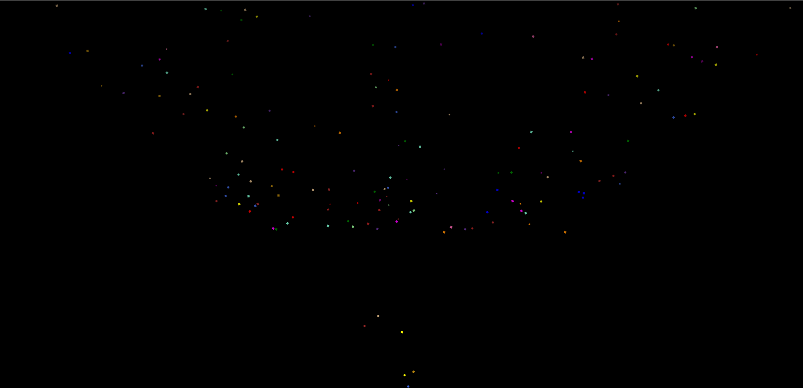

<body style="background-color='#7bc4fc'">
   <h1>Como crear una explosión de confeti:</h1>
   
    
   
Tienes que seguir los siguientes pasos:

   <ol>
        <li>
Lo primero que tienes que hacer es enlazar tu Html con el Css y el Js:

                 <ul>
                    <li>Escribe esto en tu head: '<link rel="stylesheet" href="nombreDeTuCss.css">'</li>
                    <li>Escribe esto dentro de tu body: ''</li>
                 </ul></li>
        <li>Lo segundo que tienes que hacer es copiar el contenido de styles.css a tu css.</li>
        <li>Lo último que tienes que hacer es copiar las 11 primeras líneas de script.js a tu archivo js. A continuación tienes que copiar el resto de código en el js para que se ejecute en el momento en el que quieras que aparezca el confeti.</li>
    </ol>
   
¡Espero que te sea útil!
 
   
   
Aquí puedes probar el resultado: <a href="https://barberomiguel.github.io/confeti/">link</a>

</body>
